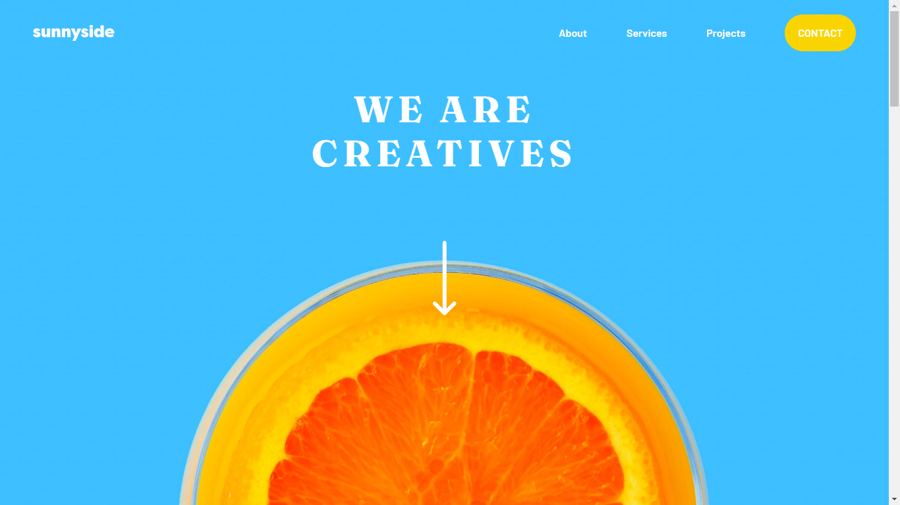
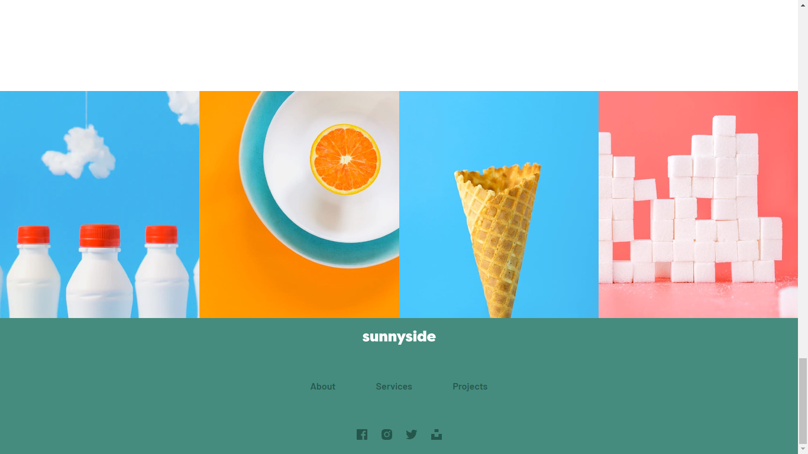

# Sunnyside agency landing page

[Frontend Mentor](https://www.frontendmentor.io) challenges help you improve your coding skills by building realistic projects.

**To do this challenge, you need a basic understanding of HTML, CSS and JavaScript.**

## Deploying your project

As mentioned above, there are many ways to host your project for free. Our recommended hosts are:

- [GitHub Pages](https://github.com/sadiquex/sunnyside-agency)
- [Vercel](https://sunnyside-agency-lac-theta.vercel.app/)
